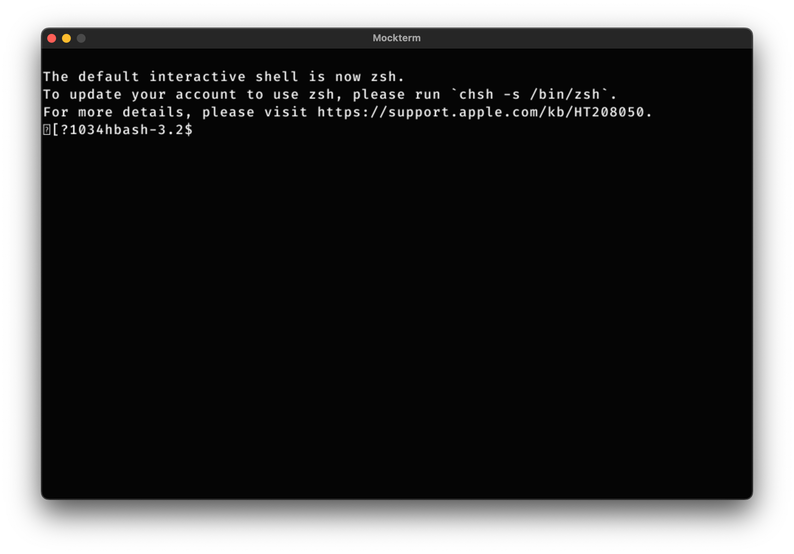

# Mockterm
Mockterm is a **simple and lightweight** terminal emulator written in **C**. Created with **SDL2**. 

## TODO
- [x] Terminal window
- [x] Window loop
- [x] Communication with pseudo-terminal
- [x] Basic input
- [ ] Better rendering and auto scrolling
- [ ] ANSI Codes
- [ ] Scrolling
- [ ] Selecting text
- [ ] Setting window and config file
